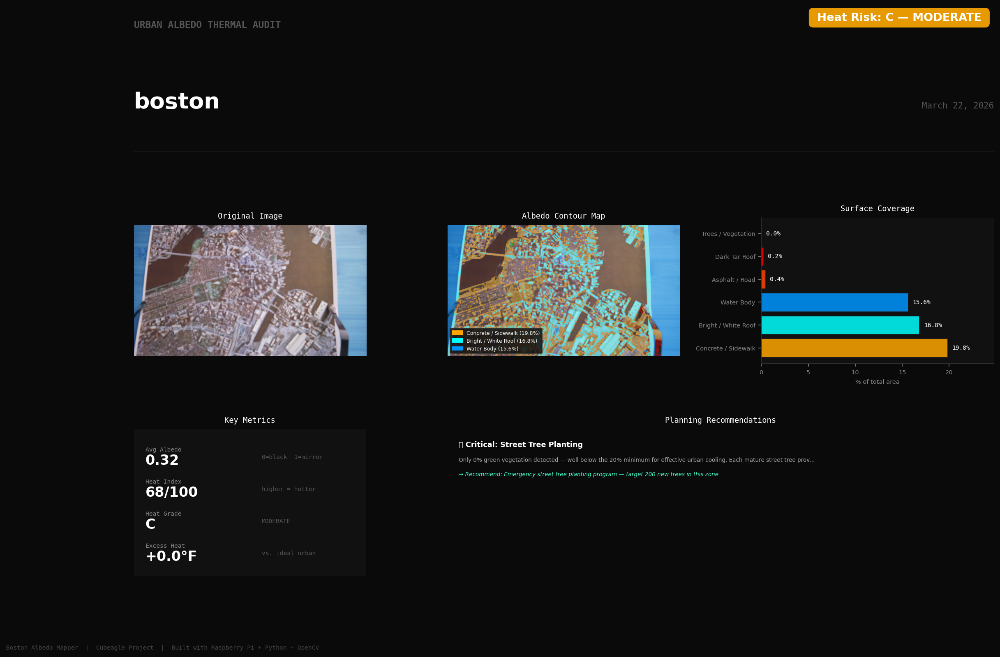
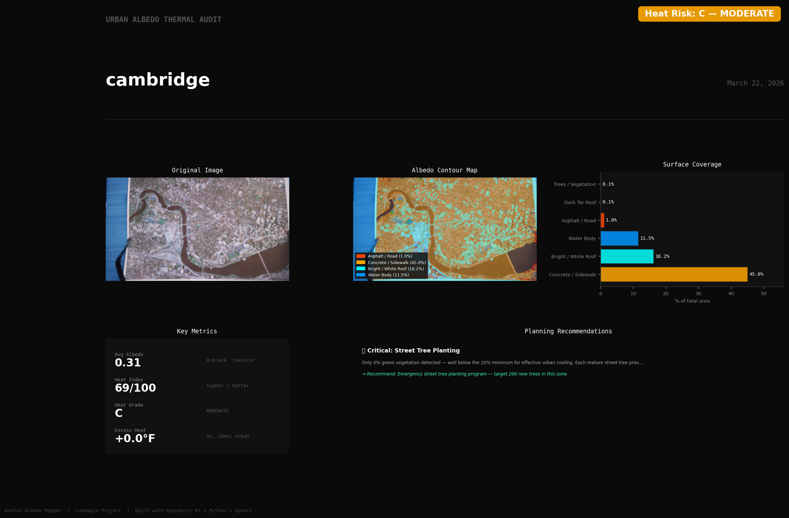
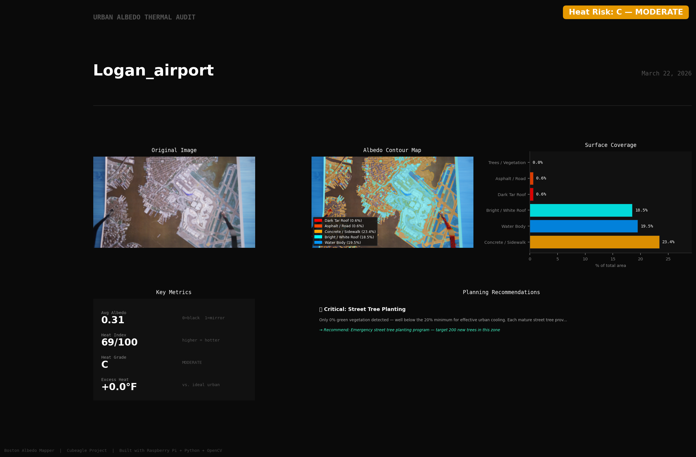
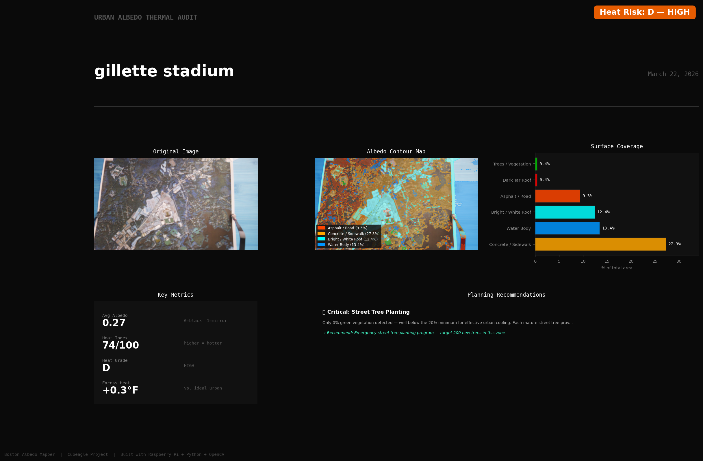

# 🛰️ Raspberry Pi Albedo Mapper
### *Team Cubeagle — Ground-Based Urban Heat Risk Analysis*

> A **Raspberry Pi 4B + Pi Camera** tool that photographs neighborhoods from ground level, detects urban surface types, calculates albedo (surface reflectivity), and generates city planning heat risk reports — all running locally on a $50 computer.

[](https://www.raspberrypi.com)
[](https://www.raspberrypi.com/products/camera-module-3/)
[](https://python.org)
[](https://opencv.org)

---

## 🌐 Web Version

Looking for the browser-based version? → **[albedo-mapper.onrender.com](https://albedo-mapper.onrender.com)**

This repo is the **Raspberry Pi local version** — runs entirely offline, no internet required after setup.

---

## 📸 Sample Output Reports

Real reports generated by this tool from Boston-area neighborhoods:

| Boston Downtown | Cambridge |
|---|---|
|  |  |

| Logan Airport | Gillette Stadium |
|---|---|
|  |  |

---

## 🔧 Hardware Requirements

| Component | Specification | Approximate Cost |
|---|---|---|
| **Raspberry Pi 4B** | 2GB RAM minimum, 4GB recommended | ~$55 |
| **Pi Camera Module** | v2 (8MP) or Camera Module 3 | ~$25 |
| **MicroSD Card** | 16GB+ Class 10 | ~$10 |
| **Power Supply** | USB-C 5V 3A | ~$10 |
| **Display** | Any HDMI monitor (for GUI mode) | — |

**Total hardware cost: ~$100** — compared to thousands for commercial urban heat mapping equipment.

---

## 📁 Project Structure

```
raspi_albedo_mapper/
│
├── capture.py              # 📷 Pi Camera capture script
├── run_audit.py            # 🖥️  CLI — batch process photos
├── run_audit_v4.py         # 🖼️  GUI — live camera + one-click analysis
├── surface_detector.py     # 🔍 HSV surface classification engine
├── albedo_calculator.py    # 📐 Albedo score + heat index formulas
├── report_generator.py     # 📊 Generates visual PNG reports
│
├── photos/                 # 🗂️  Input photos go here
│   ├── roxbury.jpg
│   ├── seaport.jpg
│   ├── jamaica_plain.jpg
│   └── norwood.jpg
│
└── outputs/                # 📋 Generated reports saved here
    ├── boston_report.png
    ├── cambridge_report.png
    ├── logan_airport_report.png
    └── gillette_stadium_report.png
```

---

## ⚙️ Raspberry Pi Setup — Step by Step

### Step 1 — Flash Raspberry Pi OS

Download **Raspberry Pi Imager** from [raspberrypi.com/software](https://raspberrypi.com/software)

Settings when flashing:
```
Device:  Raspberry Pi 4
OS:      Raspberry Pi OS (64-bit)   ← must be 64-bit
Storage: your microSD card
```

In **Advanced Settings**, set:
```
Hostname:  albedo-pi
Username:  [YOUR USERNAME]
Password:  [YOUR PASSWORD]
WiFi:      your network name + password
```

---

### Step 2 — First Boot & System Update

After booting, open **Terminal** and run:

```bash
sudo apt-get update
sudo apt-get upgrade -y
sudo reboot
```

---

### Step 3 — Enable the Camera

```bash
sudo raspi-config
```

Navigate to:
```
Interface Options → Camera → Enable → Yes → Finish → Reboot
```

Then verify your camera is detected:
```bash
rpicam-hello --list-cameras
```

You should see:
```
Available cameras
-----------------
0 : imx219 [3280x2464]    ← your Pi Camera is connected!
```

Test a live preview:
```bash
rpicam-hello
```

---

### Step 4 — Install System Dependencies

```bash
# Camera and image processing system libraries
sudo apt-get install -y \
    python3-opencv \
    python3-numpy \
    python3-matplotlib \
    python3-picamera2 \
    python3-tk \
    python3-pil \
    python3-pil.imagetk \
    libatlas-base-dev \
    libopenblas-dev \
    libhdf5-dev \
    libcamera-apps
```

---

### Step 5 — Install Python Libraries

```bash
pip3 install \
    opencv-python-headless \
    Pillow \
    scikit-image \
    --break-system-packages
```

---

### Step 6 — Verify Everything Installed Correctly

```bash
python3 -c "
import cv2
import numpy as np
import matplotlib
from picamera2 import Picamera2
from PIL import Image
print('✅ cv2:         ', cv2.__version__)
print('✅ numpy:       ', np.__version__)
print('✅ matplotlib:   OK')
print('✅ picamera2:    OK')
print('✅ Pillow:       OK')
print('')
print('All dependencies ready!')
"
```

---

### Step 7 — Clone This Repository

```bash
# Install git if not already present
sudo apt-get install -y git

# Clone the repo
git clone https://github.com/YOUR_USERNAME/raspi-albedo-mapper.git
cd raspi-albedo-mapper

# Create required folders
mkdir -p photos outputs
```

---

## 🚀 How to Run

There are **two ways** to run the mapper:

---

### Option A — GUI Mode (Recommended) 🖼️

The GUI shows a live camera feed, lets you capture with one button, then runs the full analysis.

```bash
cd raspi-albedo-mapper
python3 run_audit_v4.py
```

**What you'll see:**

```
┌─────────────────────────────────────────────┐
│  Albedo Mapper - by Cubeagle SHS 2026       │
├────────────────────┬────────────────────────┤
│                    │                        │
│   [Live Camera     │   Status Panel         │
│    Feed]           │   Log output           │
│                    │                        │
├────────────────────┴────────────────────────┤
│  [ 📸 CAPTURE ]      [ 🔬 CALCULATE ]       │
└─────────────────────────────────────────────┘
```

1. Live camera stream appears automatically
2. Point camera at your target neighborhood
3. Press **CAPTURE** to freeze and save the photo
4. Press **CALCULATE** to run the full analysis
5. Report saves to `outputs/` and opens automatically

---

### Option B — CLI Mode (Batch Processing) 🖥️

Use this to process multiple pre-saved photos at once.

**Step 1 — Take a photo with the Pi Camera:**
```bash
python3 capture.py "Roxbury Boston"
```

Output:
```
🛰️  Boston Albedo Mapper — Pi 4 Camera Capture
   Location: Roxbury Boston
────────────────────────────────────────────────
Show live preview to aim camera? (y/n): y
📹 Live preview for 5 seconds...
📷 Initializing Pi Camera...
   Warming up (3 seconds)...
   Capturing image...
✅ Photo saved!
   Path: ~/photos/roxbury_boston_20260318_143022.jpg
```

**Step 2 — Edit target list in run_audit.py:**
```python
TARGETS = [
    ("photos/roxbury.jpg",       "Roxbury — Boston"),
    ("photos/seaport.jpg",       "Seaport District"),
    ("photos/jamaica_plain.jpg", "Jamaica Plain"),
    # Add your own photos here!
]
```

**Step 3 — Run the analysis:**
```bash
python3 run_audit.py
```

Output:
```
🔍 Analyzing: Roxbury — Boston
   Image: photos/roxbury.jpg
   Processing surfaces...

📊 Surface Coverage:
   Concrete / Sidewalk       32.9%  ████████████████
   Trees / Vegetation        22.5%  ███████████
   Bright / White Roof       10.7%  █████
   Asphalt / Road             7.3%  ███
   Dark Tar Roof              4.7%  ██

📄 Generating report...
✅ Done! Report: outputs/roxbury_boston_report.png
```

---

### Option C — Use Your Own Google Earth Photos 🌍

You don't need the Pi Camera to use this tool. You can analyze any aerial image:

1. Open **Google Earth Pro** (free) on your laptop
2. Navigate to any neighborhood
3. Go to `File → Save → Save Image` (maximum resolution)
4. Copy the `.jpg` file to the `photos/` folder on your Pi
5. Run `python3 run_audit.py`

---

## 🔬 How the Analysis Works

```
📷 Photo captured (Pi Camera or Google Earth)
        ↓
surface_detector.py
  → Convert image to HSV color space
  → Create masks for 6 surface types
  → Clean noise with morphological operations
  → Find and draw contours
  → Calculate coverage % per surface
        ↓
albedo_calculator.py
  → Weighted average albedo score (0.0–1.0)
  → Heat index (0–100)
  → Letter grade (A–F)
  → Specific city planning recommendations
        ↓
report_generator.py
  → Side-by-side: original photo + contour map
  → Coverage bar chart
  → Key metrics panel
  → Planning recommendations
  → Save as PNG report
```

### Surface Types Detected

| Surface | Albedo | Heat Risk | HSV Detection |
|---------|--------|-----------|---------------|
| 🔴 Dark Tar Roof | 0.05 | CRITICAL | Very low brightness |
| 🟠 Asphalt / Road | 0.10 | HIGH | Low-medium brightness, low saturation |
| 🟡 Concrete / Sidewalk | 0.25 | MEDIUM | Medium brightness, low saturation |
| 🩵 Bright / White Roof | 0.65 | LOW | Very high brightness |
| 🟢 Trees / Vegetation | 0.20 | BENEFICIAL | Green hue range |
| 🔵 Water Body | 0.06 | COOLING | Blue hue range |

---

## 📂 View Reports

**On the Pi desktop:**
```bash
eog outputs/boston_report.png
```

**From any browser on your WiFi network:**
```bash
# Start a web server on the Pi
cd outputs
python3 -m http.server 8080
```
Then open: `http://YOUR_PI_IP_ADDRESS:8080`

Find your Pi's IP:
```bash
hostname -I
```

**Copy reports to your Windows laptop:**
```powershell
# On Windows PowerShell
scp pi@PI_IP_ADDRESS:~/raspi-albedo-mapper/outputs/*.png C:\Users\YOUR_NAME\Desktop\
```

---

## 🛠️ Troubleshooting

| Problem | Solution |
|---|---|
| `No module named 'cv2'` | `sudo apt-get install -y python3-opencv` |
| `No module named 'picamera2'` | `sudo apt-get install -y python3-picamera2` |
| `No cameras found` | Run `sudo raspi-config` → Interface Options → Camera → Enable → Reboot |
| `libcamera: command not found` | Use `rpicam-hello` instead — newer Pi OS uses `rpicam` |
| `Permission denied on camera` | `sudo usermod -aG video pi` then reboot |
| Photo is very blurry | Increase warmup: change `time.sleep(3)` to `time.sleep(5)` in `capture.py` |
| Report takes too long | Reduce resolution in `capture.py`: change to `resolution=(1920, 1080)` |
| Colors look wrong on report | Run calibration: click on surfaces in your photo to check HSV values |

---

## 📊 Research Applications

This tool was built to support real environmental science research:

- **🏘️ Environmental Justice** — Do lower-income neighborhoods absorb more heat?
- **📅 Temporal Change** — How has Boston lost green coverage over 20 years?
- **🌿 Green Roof ROI** — How many green roofs would cool a neighborhood by 1°F?
- **🛰️ Satellite Validation** — How accurate is NASA MODIS data vs. ground truth?

**Target neighborhoods studied:**
Roxbury · Seaport District · Jamaica Plain · Norwood · Cambridge · Logan Airport area · Gillette Stadium area

---

## 🏫 About Team Cubeagle

Built by **Team Cubeagle**, high school students from the Boston area (SHS Class of 2026), as part of the **MIT BWSI CubeSat program**. This ground-based tool extends our original CubeSat orbital albedo mission concept to street-level neighborhood analysis.

**Team members:** Charles He, Daniel Gao, Daniel Ge, Hanson Zhu

---

## 📄 License

MIT License — free to use, modify, and share with attribution.

---

<div align="center">

**Built with 🛰️ by Team Cubeagle · SHS · Boston, MA · 2026**

[Web Version](https://albedo-mapper.onrender.com) · [Report an Issue](https://github.com/YOUR_USERNAME/raspi-albedo-mapper/issues)

</div>
